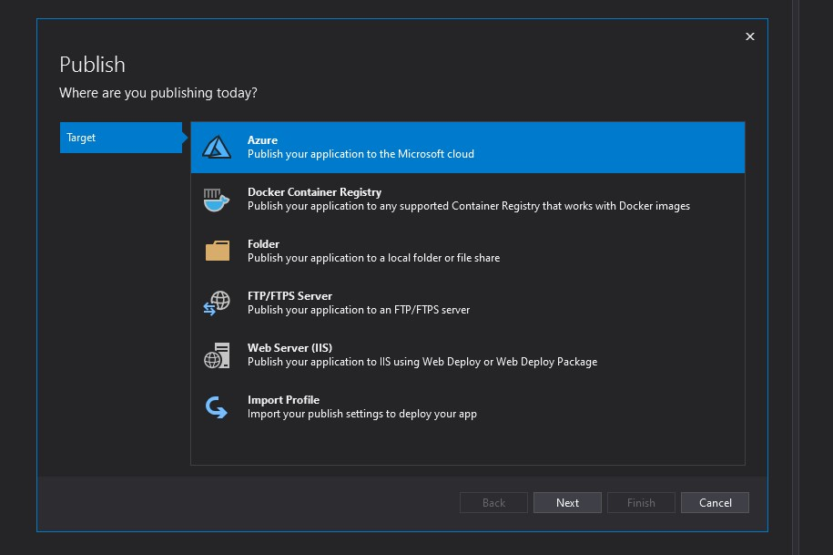
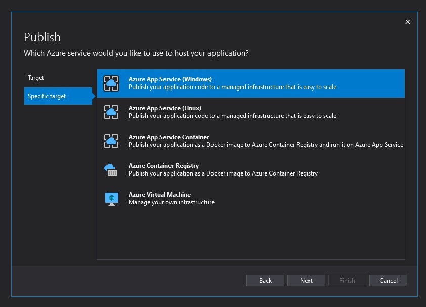
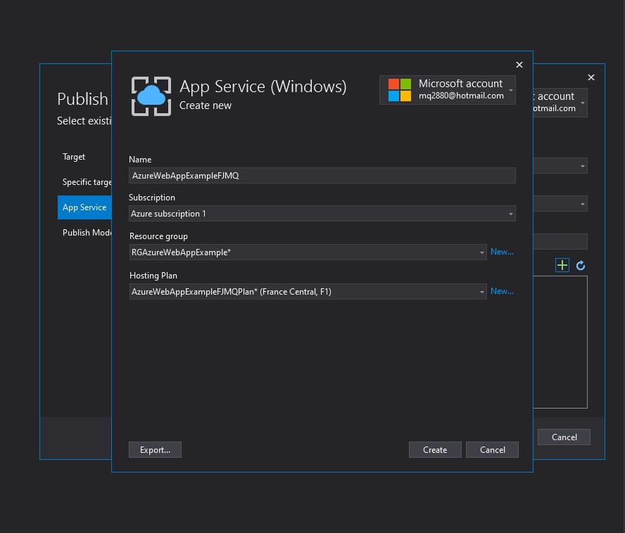
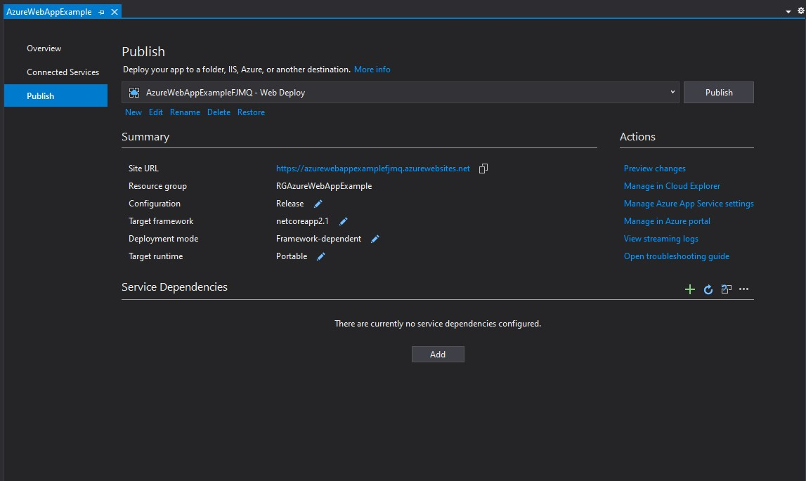
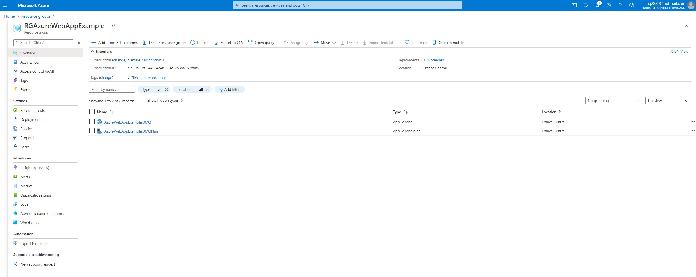
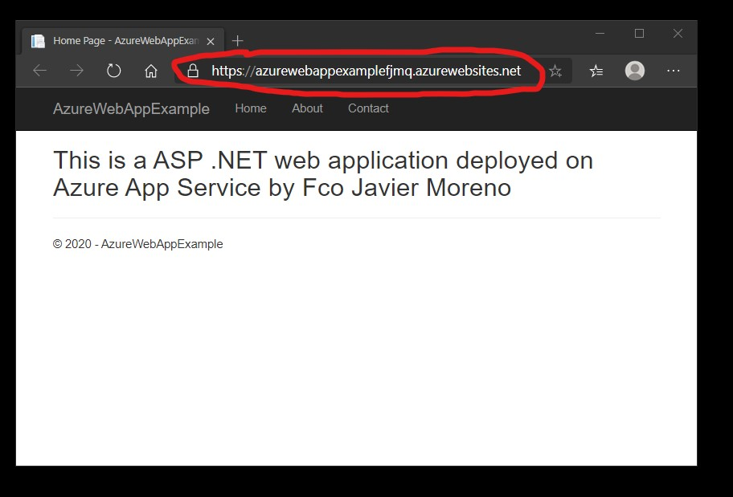

# Tareas del MOC

## Module 14: Hosting and Deployment

# Lesson 2: Deployment to Microsoft Azure

### Demonstration: How to Deploy a Web Application to Microsoft Azure

- Creamos un nuevo proyecto **ASP.NET Core Web Application** y lo llamamos **AzureWebAppExample**

- Publicamos y seleccionamos como destino Azure

  

  

  

- Seleccionamos Azure App Service (Windows)

  

  

  

- Le damos un nombre unico **AzureWebAppExampleFJMQ**

- Creamos un grupo de recursos nuevo **RGAzureWebAppExample**

- Seleccionamos un plan de alojamiento en este caso he elegido que se ubique en Francia Central y gratis

- Pulsamos en crear

- Ya tenemos la publicación configurada

- Comprobamos lo que ha creado

- Cambiamos la pagina de inicio y publicamos

